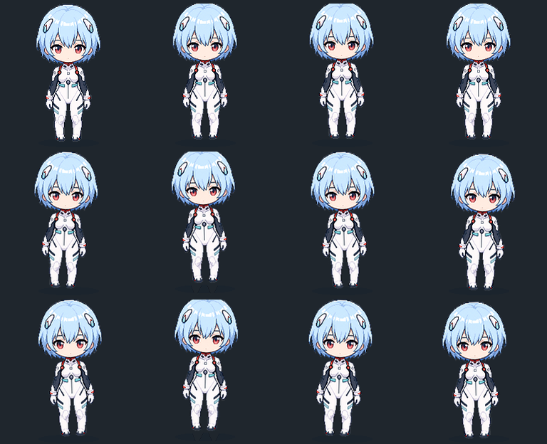
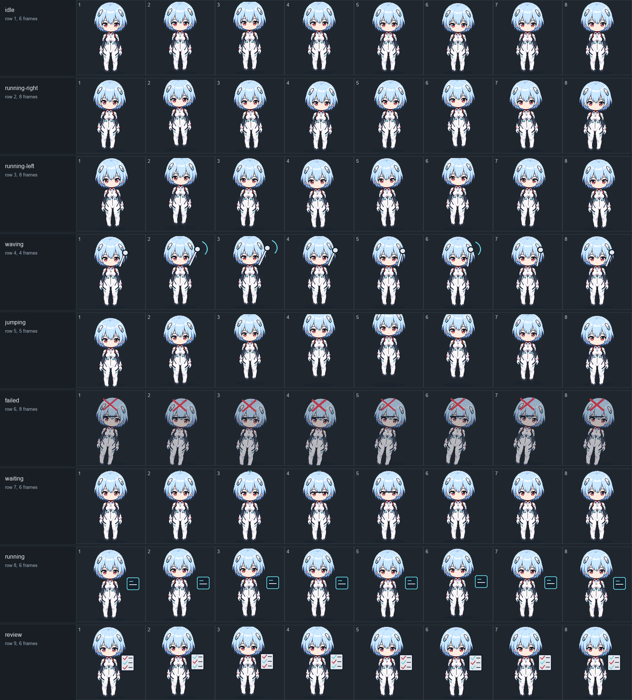
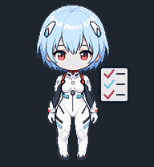

# Blue Pilot: Ayanami Rei Inspired Codex Pet

A fan-made Codex pet inspired by Ayanami Rei, with an original quiet blue-haired sci-fi pilot design, a white suit, soft cyan accents, and calm chibi energy.

This is an unofficial fan-made pet. It is not affiliated with, endorsed by, or using official Evangelion assets.

## Preview



## Actions



| Idle | Running | Waiting |
| --- | --- | --- |
|  |  |  |

| Waving | Review | Failed |
| --- | --- | --- |
|  |  |  |

## Install

Copy this folder to:

```text
~/.codex/pets/rei-blue-pilot
```

Make sure these two files are directly inside the folder:

```text
pet.json
spritesheet.webp
```

Then open Codex:

1. Go to Settings > Appearance > Pets.
2. Click Refresh.
3. Select Blue Pilot.
4. Use `/pet` or Wake Pet if the desktop pet is tucked away.

## Package

- `pet.json`: Codex pet manifest.
- `spritesheet.webp`: 8 x 9 Codex-compatible spritesheet, 1536 x 1872 px.
- `blue-pilot.codex-pet.zip`: ready-to-share package.
- `preview.png`: quick preview.
- `actions-overview.png`: full action sheet preview.
- `action-previews/`: animated GIF previews for each action.

## Attribution

Created as an original Codex pet package by Y1Shen.
